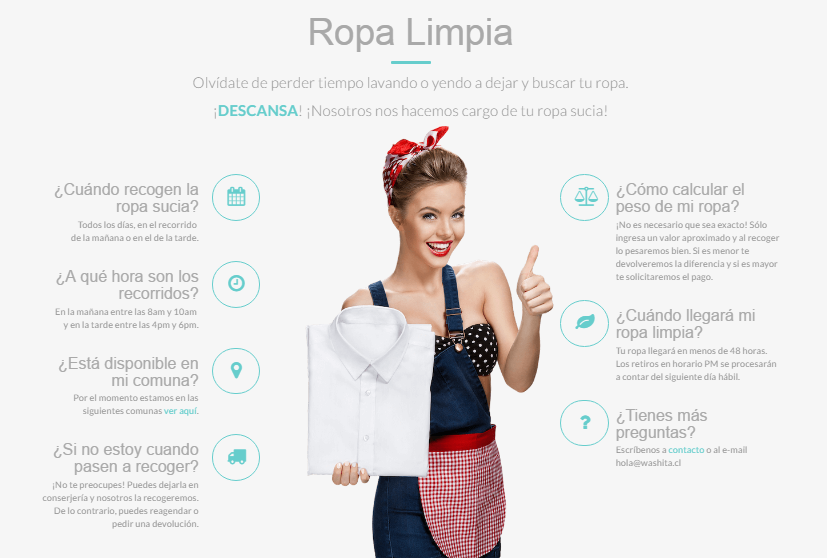

### SOFTWARE REQUIREMENTS SPECIFICATION

# Washita

### *Project Functional Requirement Specification , Version 1*
 
##### Prepared by: O.Semenova

Contents
1. [Purpose of the document](#Purpose-of-the-document)
2. [Project Overview](#Project-Overview)  
2.1 [Audience](#Audience)  
2.2 [Hardware and Hosting](#Hardware-and-Hosting)
3. [Information Architecture](#InformationArchitecture)  
3.1 [Washita site](#Washita-site)  
3.1.1 [Washita](#Washita)  
3.1.2 [Fácil y rápido / Easy and fast](#Fácil-y-rápido/Easy-and-fast)   
3.1.2.1 [Haz tu pedido / Make your order](#Haz-tu-pedido/Make-your-order)  
3.1.2.2 [Recogemos tu ropa / We pick up your clothes](#Recogemos-tu-ropa/We-pick-up-your-clothes)  
3.1.2.3 [Ropa limpia en tus manos / Cleaned clothes in your hands](#Ropa-limpia-n-tus-manos/Cleaned-clothes-in-your-hands)  
3.1.3 [Ropa Limpia / Clean clothes](#Ropa-Limpia/Clean-clothes)  
3.1.3.1 [“Cuándo recogen la ropa sucia?” / “When is dirty laundry picked up?”](#pickupdaytime)  
3.1.3.2 [“A qué hora son los recorridos?” / “At what time exactly?”](#pickuptime)  
3.1.3.3 [“Está disponible en mi comuna?” / “Is it available in my commune?“](#availability)  
3.1.3.4 [“Si no estoy cuando pasen a recoger?” / “If I’m not available at the moment of picking up, when can it be collected?”](#I’m-not-available)  
3.1.3.5 [“Cómo calcular el peso de mi ropa?” / “How to calculate the weight of my clothes?”](#to-calculate-weight)  
3.1.3.6 [“Cuándo llegará mi ropa limpia?” / “When will my clothes be ready?”](#timereadiness)  
3.1.3.7 [Tienes más preguntas? / “You have more questions?”](#contact)  
3.1.4 [Dónde está WASHita? / Where is Washita”](#distribution)  
3.1.5 [Precios / Price](#Price)
3.1.5.1 [Lavado y Doblado / Washing and drying](#Washing-and-drying)  
3.1.5.2 [Sólo planchado / Ironing only](#Ironing)  
3.1.5.3 [Lavaseco / Special cleaning](#Special-cleaning)  
3.1.5.4 [Hogar / Home items cleaning](#Home-items-cleaning)  
3.1.6 [Details of order](#Details-of-order)  
3.1.7 [Contacto / Contacts](#Contacts)  
3.1.8  [Ingresar / Sign in](#Sign-in)
3.1.9 [End of page](#End-of-page)  
4. [Site Design](#Site-Design)  
4.1 [Aesthetic/HTML Requirements and Guidelines](#Guidelines)  
5. [Sign-Off Document](#Sign-Off-Document)

 

# 1.  Purpose of the document:

This is not a project plan. It is a guide for system architecture and development, not for phasing, timelines or deliverables.
 
This document is divided into three sections:
+ Project Overview
+ Information Architecture
+ Site Design

# 2.  Project Overview:

### 2.1  Audience:
This document is intended as a complete guide for customers using Washita.cl 1.0. By reading this guide, you will learn how to use Washita.cl through the elements of the graphical user interface and what's behind some of the advanced features that are not always obvious at first sight. It will hopefully guide you around some common problems that frequently appear for users of Washita.cl.

### 2.2  Hardware and Hosting:
 
Washita’s servers will be hosted at **X** company’s site.  
**Washita will be hosted on two servers: One to host the actual website and (language)code, and the other to host the (database name)database.**

# 3.  Information Architecture

Visit http://washita.cl site

### 3.1  Washita site

Washita is a powerful tool providing its customers with the ability to have their clothes, linen and home items to be washed, ironed, well folded and specially cleaned. The service offers **free** collection and delivery. Customers’ household laundry is picked up at their premises and delivered back minimum in two days.
Those who wish to use the service do not need register in. Therefore, this makes the application simplier to use. However, personal accounts are available on the site, where customers can find the history of their orders.

#### 3.1.1  Washita

When a Washita-User visits  the site for the first time, the first thing they will see is the main page  as shown in Figure 1. They are able to scroll down the page for more information or click tabs.  In addition, a user can register in.  
Figure 1:
 
 
 
 

   
 
#### 3.1.2  Fácil y rápido / Easy and fast

The Washita-user can scroll down to this section or click tab “Cómo Funciona”, or click button “Cómo funciona”

Figure 2:

 
The Washita-user will see the information, namely three steps, about how the service works. The information is shown by three graphic pictures each of which depicts short explanation.

##### 3.1.2.1   Haz tu pedido / Make your order

Here is a link in the text to the page to make an order

<table>
  <tr>
	<th>Spanish</th>
	<th>English</th>
  </tr>

  <tr>
	<td>Ingresa a **LAVAR AHORA**, indica la cantidad de ropa y realiza tu pedido vía web</td>
	<td>Enter **WASH NOW**, indicate the amount of clothing and place your order via **the web**</td>
  </tr>
</table>

##### 3.1.2.2   Recogemos tu ropa / We pick up your clothes

<table>
  <tr>
	<th>Spanish</th>
	<th>English</th>
  </tr>

  <tr>
	<td>Elige en qué horario te acomoda e iremos al lugar que nos indiques a recoger tu ropa</td>
	<td>Choose what time it will fit you and we will come to the place that you has indicated for collecting your clothes</td>
  </tr>
</table>

##### 3.1.2.3  Ropa limpia en tus manos / Cleaned clothes in your hands
 
<table>
  <tr>
	<th>Spanish</th>
	<th>English</th>
  </tr>

  <tr>
	<td>En poco tiempo tendrás tu ropa LAVADA, PLANCHADA y DOBLADA lista para usarla</td>
	<td>In a short time you will have your clothes WASHED, IRONED and FOLDED to **wear**</td>
  </tr>
</table>

#### 3.1.3  Ropa Limpia / Clean clothes

The Washita-user can scroll down to this section after the section ”Fácil y rápido” / “Easy and fast”
This section is designed as more extensive explanation to “How the service works” and gives short answers to FAQ and therefore, points out advantages of using Washita service.

Figure 3:

 
 
<table>
  <tr>
	<th>Spanish</th>
	<th>English</th>
  </tr>

  <tr>
	<td>Olvídate de perder tiempo lavando o yendo a dejar y buscar tu ropa. DESCANSA! Nosotros nos hacemos cargo de tu ropa sucia</td>
	<td>Forget about wasting time on doing laundry or going to laundry. 
HAVE A REST! We’ll take care of your dirty clothes and linen</td>
  </tr>
</table>
 
##### 3.1.3.1  “Cuándo recogen la ropa sucia?” / “When is dirty laundry picked up?”

<table>
  <tr>
	<th>Spanish</th>
	<th>English</th>
  </tr>

  <tr>
	<td>Todos los días, en el recorrido de la mañana o en el de la tarde</td>
	<td>Every day in the morning and afternoon</td>
  </tr>
</table>

##### 3.1.3.2  “A qué hora son los recorridos?” / “At what time exactly?”

<table>
  <tr>
	<th>Spanish</th>
	<th>English</th>
  </tr>

  <tr>
	<td>En la mañana entre las 8 a.m. y 10 a.m. y en la tarde entre las 4 p.m. y 6 p.m.</td>
	<td>In the morning between 8 a.m. and 10 a.m., and in the afternoon between 4 p.m. and 6 p.m.</td>
  </tr>
</table>

##### 3.1.3.3  “Está disponible en mi comuna?” / “Is it available in my commune?“

<table>
  <tr>
	<th>Spanish</th>
	<th>English</th>
  </tr>

  <tr>
	<td>Por el momento estamos en las siguientes comunas ver aquí</td>
	<td>At the moment we are in the following communes see here. (here is the link to the section of the site "Dónde está WASHita? / Where is washita?"</td>
  </tr>
</table>

##### 3.1.3.4  “Si no estoy cuando pasen a recoger?” / “If I’m not available at the moment of picking up, when can it be collected?”

<table>
  <tr>
	<th>Spanish</th>
	<th>English</th>
  </tr>

  <tr>
	<td>No te preocupes! Puedes dejarla en conserjería y nosotros la recogeremos. De lo contrario, puedes reagendar o pedir una devolución</td>
	<td>Do not worry! You can leave your laundry at concierge’s and we will pick it up. Otherwise, you can reschedule pick up time or <b>request for refund</b></td>
  </tr>
</table>

##### 3.1.3.5  “Cómo calcular el peso de mi ropa?” / “How to calculate the weight of my clothes?”

<table>
  <tr>
	<th>Spanish</th>
	<th>English</th>
  </tr>

  <tr>
	<td>No es necesario que sea exacto! Sólo ingresa un valor aproximado y al recoger lo pesaremos bien. Si es menor te devolveremos la diferencia y si es mayor te solicitaremos el pago</td>
	<td>It doesn’t need to be exactly! Only enter an approximate value. The laundry will be weighed at our place after collection. If it is less, we will refund the difference, and if it is more, we will ask for payment</td>
  </tr>
</table>

##### 3.1.3.6  “Cuándo llegará mi ropa limpia?” / “When will my clothes be ready?”

<table>
  <tr>
	<th>Spanish</th>
	<th>English</th>
  </tr>

  <tr>
	<td>Tu ropa llegará en menos de 48 horas. Los retiros en horario PM se procesarán a contar del siguiente día hábil</td>
	<td>Your clothes will arrive in <b>less</b> than 48 hours. Withdrawals in PM hours will be processed from the next business day</td>
  </tr>
</table>
 
##### 3.1.3.7  Tienes más preguntas? / “You have more questions?”

<table>
  <tr>
	<th>Spanish</th>
	<th>English</th>
  </tr>

  <tr>
	<td>Escríbenos a contacto o al e-mail</td>
	<td>Contact us (here is the link to section “Contacto” / Contacts”) or email us hola@washita.cl</td>
  </tr>
</table>
 
 
#### 3.1.4  Dónde está WASHita? / Where is Washita?
This section can be reached by either further scrolling down or clicking tab “Dónde” as it is highlighted red in Figure 4.

Figure 4:

 

<table>
  <tr>
	<th>Spanish</th>
	<th>English</th>
  </tr>

  <tr>
	<td>Si aún no aparecemos en tu comuna, escríbenos a contacto 
y trataremos de habilitar la zona lo antes posible</td>
	<td>If we still do not appear in your commune, write to us and we will try to include the area in the list of Washita as soon as possible</td>
  </tr>
</table>
 
#### 3.1.5  Precios / Price

The Washita-user can  reach this section by either further scrolling down or clicking tab “Precios” as it is highlighted red in Figure 5.

Figure 5:
 
 
Seeing prices, the user can select one of the two main services being provided by Washita: washing and drying, and ironing.

##### 3.1.5.1  Lavado y Doblado / Washing and drying

The Washita-user can  reach this section by either clicking “Lavado y Doblado” / “Washing and drying” in the section “Precios” / “Price” or clicking the tab “LAVAR AHORA” / “WASH NOW”  as it is highlighted red in Figure 6.

Figure 6:

 
The Washita-user sees the price for 1 kg of laundry. He can increase the weight of laundry to have it washed and dried.
The user can tick off “Agregar planchado” / “Add ironing” to have his clothes ironed. In case of adding “ironing” as one more option of service, the user can type in kinds of items and their quantity to be ironed.

Figure 7:
 
 
The user can type in “Código Descuento” / “Discount code”.
As long as the user makes any changes in the left-hand side of the screen by changing the weight of laundry, adding ironing as one more service or using discount number, the price for the service changes at once, which can be examined in the right-hand of the screen.

Figure 8:

 
##### 3.1.5.2  Sólo planchado / Ironing only

The Washita-user can  reach this section by either clicking “Sólo planchado” / “Ironing only” in the section “Precios” / “Price” or clicking the tab Sólo planchado” / “Ironing only” in the section “LAVAR AHORA” / “WASH NOW” as it is highlighted red in Figure 9.

Figure 9:
 
 
In the right-hand side of the screen, the Washita-user sees the price for 1 kg of laundry for ironing. The weight can be increased.

The option for hangers is set by default and therefore the price is included in the order summary.
If the user does not want to have his clothes hanged, he can choose the option to have clothes well folded. In this case the price for hangers is excluded from the order summary.

The user can type in “Código Descuento” / “Discount code”.
As long as the user makes any changes in the left-hand side of the screen by changing the weight of laundry for ironing, choosing to have clothes hanged or well folded, and/or using discount number, the price for the service changes at once, which can be examined in the right-hand of the screen.

##### 3.1.5.3  Lavaseco / Special cleaning

The Washita-user can  reach this section by clicking the tab “Lavaseco” / “Special cleaning” in the section “LAVAR AHORA” / “WASH NOW” as it is highlighted red in Figure 10.

Figure 10:
 
 
In the left-hand side of the screen, the Washita-user can choose and set the quantity of items to be special or dry cleaned.
The user can type in “Código Descuento” / “Discount code”.
In the right-hand side of the screen the price for service changes as soon as the options for the service changes in the left-hand side of the screen.

##### 3.1.5.4  Hogar / Home items cleaning

The Washita-user can  reach this section by clicking the tab “Lavaseco” / “Special cleaning” in the section “LAVAR AHORA” / “WASH NOW” as it is highlighted red in Figure 11.

Figure 11:
 
 
In the left-hand side of the screen, the Washita-user can choose and set the quantity of home items to be cleaned.
The user can type in “Código Descuento” / “Discount code”.
In the right-hand side of the screen the price for service changes as soon as the options for the service changes in the left-hand side of the screen.

#### 3.1.6  Details of order

This section can be reached by scrolling down after one of the service, i.e. it is the same for all the four types of services.

Figure 12:

 
The second part of every of the four types of order is represented by entering  user information: his name, town/city, address line, e-mail, whatsapp, dates of dispatch and delivery, the field for special request.

To make order, the following fields are necessary to be populated:

• Nombre / Name
• Ciudad / City/Town
• Dirección / Address line
• Email
• Horario de Retiro / Collection time
• Horario de Entrega / Delivery time

Collection and delivery time can be set only on working days.

The following fields are up to user to fill up while making order:
• Whatsapp
• Peticiones Especiales / Special Requests

Once you have completed this form, tick off "Acepto los términos y condiciones de uso" / "I accept terms and conditions of use" and click “CONFIRMAR PEDIDO” / "CONFIRM ORDER".

#### 3.1.7  Contacto / Contacts

The Washita-user can  reach this section by either further scrolling down or clicking tab “Precios” as it is highlighted red in Figure 13.

Figure 13:

<table>
  <tr>
	<th>Spanish</th>
	<th>English</th>
  </tr>

  <tr>
	<td>Cómo te podemos ayudar?</td>
	<td>How can we help you?</td>
  </tr>
</table>

To contact Washita team member, the following fields are necessary to be populated:

• Tu nombre / Your name
• Tu apellido / Your last name
• Tu email / Your email
• Tu comuna/ Your commune
• Mensaje / Message

Once you have completed this form click “ENVIAR” / "SUBMIT".

Otherwise, the user can click on link **hola@washita.cl** to send email

#### 3.1.8   Ingresar / Sign in

The Washita-user can  reach this section by clicking tab “Ingresar” as it is highlighted red in Figure 14.

Figure 14:

1. If the user is existed Washita-customer, to sign in, the user can do it in three ways:

1) to fill up the fields with his e-mail and password, and click on the button "Log-in"
2) to sign in via facebook
3) to sign in via google account

2. If it has been the first time the user on the site, he can register in by clicking on link "Regístrate aquí / Sign up here"

Figure 15:

The user can register in in three ways:

1) the user can enter his e-mail, password twice and click the button "Registrarse / Check in"
2) the user can register in via facebook
3) the user can register in via google account

#### 3.1.9  End of page

The end of every page is designed as in Figure 14.

Figure 16:

There is link to the page where Términos y Condiciones de Uso / Terms and conditions of use are described.

<table>
  <tr>
	<th>Spanish</th>
	<th>English</th>
  </tr>

  <tr>
	<td><b>Valores Mínimos.</b> El monto mínimo que se cobrará al cliente de Washita para el servicio de lavado es el equivalente al valor de una carga de 1kg. El servicio de Lavado y Doblado tiene un valor de 3 mil 600 pesos por kilo de carga cuando el pedido es entre 1kg y 5.99kg. El servicio de Lavado y Doblado tiene un valor de 3 mil 200 pesos por kilo de carga cuando el pedido es de 6kg o más. El servicio de Lavado y Doblado no somete a las prendas a tratamiento específico de desmanchado, por lo que existe la posibilidad de que algunas manchas adheridas en exceso no logren ser removidas. El servicio de Lavado y Doblado sólo permite un máximo de dos camisas por kilo de ropa cancelada. El servicio de Sólo Planchado tiene un valor de 3 mil pesos por kilo de carga, y se puede enviar la cantidad de camisas equivalentes a un kilo de peso por carga.

<b>Proceso de Órdenes de Trabajo.</b> Todas las órdenes deben ser canceladas antes de que la orden de trabajo sea activada, las órdenes impagas no serán procesadas.

<b>Prendas sin reclamar.</b> Todas las prendas que no sean recibidas por el cliente durante el despacho al lugar y hora indicada, serán entregadas dentro de las próximas 48 horas en el mismo lugar y hora. Las prendas no recibidas por segunda instancia en el lugar y hora indicada, serán guardadas por un período máximo de 30 días. Durante ese período el cliente deberá contactarse por teléfono o correo electrónico para coordinar con Washita el momento y lugar de entrega definitiva. Si durante los 30 días el cliente no toma contacto con Washita, serán consideradas abandonadas y se donarán a caridad.

<b>Daños en Prendas.</b> Washita se preocupa de aplicar protocolos y procedimientos que permitan alcanzar y asegurar altos estándares de calidad y políticas para el cuidado de prendas. Esto mediante la supervisión de la ejecución de cada uno de los procesos y subprocesos en los cuales se ve sometida cada prenda. Sin embargo, Washita no asume la responsabilidad por fallas o daños en prendas o productos que sean atribuibles al uso o el tiempo, como roturas y/o decoloraciones. En el caso de manchas que no puedan ser retiradas sin producir un daño a la prenda, tampoco se asumirá esa responsabilidad, por lo que la prenda será devuelta con la(s) mancha(s) en la condición que haya quedado posterior al proceso de lavado normal. La Misión de Washita es ser una empresa que ofrece un servicio de calidad y mejorar la calidad de vida de sus clientes, y para ello pondremos el máximo esfuerzo y compromiso en nuestro servicio. En caso de que suceda un daño que haya sido comprobadamente ocasionado por Washita, asumiremos la responsabilidad y devolveremos hasta (3) tres veces el costo del servicio recibido, independiente a la marca o condición de la prenda. Cualquier reclamos por daños debe ser comunicado a hola@washita.cl dentro de los siguientes 5 días hábiles de recibida la prenda.

<b>Extravíos de Prendas.</b> Cualquier prenda faltante debe ser reportada en hola@washita.cl dentro de los siguientes 5 días hábiles a contar de recepcionada la carga. Washita se preocupa de mantener un seguimiento efectivo de las prendas durante todo el proceso, para lo cual ejecutamos supervisión y trackeo exhaustivo de las cargas, tanto en terreno como por monitoreo remoto desde la central de operaciones. En caso de cualquier pérdida ocasionada por Washita, asumiremos la responsabilidad y devolveremos hasta (3) tres veces el costo del servicio recibido, independiente a la marca o condición de la prenda. Las prendas se considerarán perdidas después de 30 días desde recibido el reclamo.

<b>Elementos Personales.</b> Washita se compromete a devolver cualquier accesorio como joyas, lapiceras, relojes, efectivo, botones desmontables, colleras, cintas, gorros, cinturones, o cualquier item suelto que pueda venir en una prenda. Sin embargo, no nos hacemos responsables por extravíos o pérdida de dichos elementos, ni daños que puedan ocasionar por el no retiro de estas. Es responsabilidad del cliente enviar las prendas sin ningún tipo de elemento que esté sujeto a pérdida. Solicitamos a nuestros clientes que previo al envío de las prendas retiren estos ítems.

<b>Plazos.</b> Washita se compromete a hacer su máximo esfuerzo para completar la devolución de las prendas al cliente dentro de 48 horas. Sin embargo, este debe comprender que el plazo de demora está sujeto a factores variables como el tipo de prenda y el volumen de la carga, entre otros. Independiente de ello, la devolución de la carga no superará las 72 horas hábiles desde recepcionada, y en caso de sobrepasar dicho plazo, se aplicarán medidas compensatorias como descuentos para el cliente afectado en su próximo pedido.

<b>Sistema de Pago.</b> Todos los pagos se hacen con cargo a la tarjeta de crédito que registres en el sistema. Todas nuestras transacciones son seguras y se realizan a través de Transbank o Paypal. Para clientes que desean pagar una vez al mes, pueden escoger esta opción al momento de registrarse o en la página web y hacer el pago vía webpay de Transbank o Paypal.

<b>Servicio de Lavado.</b> Washita podrá unilateralmente decidir ya sea realizar el servicio de lavado de prendas en sus propias instalaciones o en instalaciones de empresas de lavado asociadas por cada sector, esto en beneficio de mantener una respuesta adecuada a los plazos ofrecidos al cliente y fomentar el compromiso en la calidad de servicio en el comercio local. Washita fiscalizará permanentemente que los estándares de calidad por parte de los proveedores sean los adecuados para cumplir con las expectativas de los clientes.

<b>Cobertura.</b> Washita entrega servicio de lavandería a domicilio sólo en las comunas que específica y delimita en la sección de la página web en dónde hace referencia a la cobertura. Sin perjuicio de lo anterior, continuamente se está trabajando para poder aumentar las áreas de cobertura en donde se entrega el servicio.

<b>Proceso de Órdenes de Trabajo.</b> Todas las órdenes deben ser canceladas antes de que la orden de trabajo sea activada, las órdenes impagas no serán procesadas.

<b>Instructivo de Lavado por Carga.</b> (a)Las prendas que se procesan en el servicio de lavado por carga, deben ser aquellas que por indicación del fabricante se someten a lavado normal por máquina al agua y secado en máquina. (b)La persona que retira las cargas de ropa no separa ni revisa sus prendas. (c)No deben incluirse prendas delicadas que requieran de un procedimiento especial ni distinto al lavado normal en máquina. (d)El cliente debe llevar las prendas oscuras y claras por separado. (e)La empresa no se responsabiliza por teñidos ni deterioros. (f)El servicio no incluye desmanchado. (g)El servicio de lavado por carga incluye planchado. (h)Washita exige a sus proveedores de lavado que procesen cada bolsa individualmente.
</td>
	<td><b>Minimum values.</b> The minimum amount that will be charged to the Washita customer for the washing service is the equivalent of the value of a 1kg load. The Washing and Folding service has a value of 3 600 pesos per kilo of load when the order is between 1kg and 5.99kg. The Washing and Folding service has a value of 3 thousand 200 pesos per kilo of load when the order is 6kg or more. The Washing and Folding service does not subject the garments to specific treatment of de-stemming, so there is a possibility that some excess adhered stains can not be removed. The Washing and Folding service only allows a maximum of two shirts per kilo of clothes canceled. The Only Ironing service has a value of 3 thousand pesos per kilo of cargo, and you can send the number of shirts equivalent to one kilo of weight per load.

<b>Process of Work Orders.</b> All orders must be canceled before the work order is activated, unpaid orders will not be processed.

<b>Unclaimed clothing.</b> All items that are not received by the customer during the delivery to the place and time indicated, will be delivered within the next 48 hours at the same place and time. Garments not received by the second time in the place and time indicated, will be kept for a maximum period of 30 days. During this period the customer should contact by phone or email to coordinate with Washita the time and place of final delivery. If during the 30 days the customer does not contact Washita, they will be considered abandoned and donated to charity.

<b>Damage on Garments.</b> Washita is concerned with applying protocols and procedures to achieve and ensure high quality standards and policies for garment care. This is done by supervising the execution of each of the processes and subprocesses in which each garment is submitted. However, Washita assumes no liability for defects or damages in clothing or products that are attributable to use or time, such as breakage and / or discoloration. In the case of stains that can not be removed without causing damage to the garment, neither responsibility will be assumed, so that the garment will be returned with the stain (s) in the condition that has remained after the process of Normal washing. The Mission of Washita is to be a company that offers a quality service and improve the quality of life of its clients, and for this we will put the maximum effort and commitment in our service. In the event of any damage that has been proven to be caused by Washita, we will assume responsibility and refund up to (3) three times the cost of the service received, regardless of the brand or condition of the garment. Any claims for damages must be communicated to hola@washita.cl within 5 business days of receipt of the pledge.

<b>Lost Gifts.</b> Any missing items must be reported to hola@washita.cl within 5 business days of receipt of the cargo. Washita is concerned with maintaining an effective follow-up of the garments throughout the entire process, for which we execute supervision and exhaustive track of the loads, both in the field and by remote monitoring from the operations center. In the event of any loss caused by Washita, we will assume responsibility and refund up to (3) three times the cost of the service received, regardless of the brand or condition of the garment. Garments will be considered lost after 30 days from receipt of the claim.

<b>Personal Elements.</b> Washita agrees to return any accessories such as jewelry, pens, watches, cash, removable buttons, collars, ribbons, caps, belts, or any loose item that may come in a garment. However, we are not responsible for loss or loss of mentioned above elements, nor any damages that may be caused by the non-removal of these elements. It is the responsibility of the client to send the garments without any element that is subject to loss. We ask our customers to remove these items prior to the shipment of the garments.

<b>Deadlines.</b> Washita agrees to make every effort to complete the return of the garments to the customer <b>within</b> 48 hours. However, it must understand that the delay period is subject to variable factors such as the type of garment and the volume of the load, among others. Independently of this, the return of the load will not exceed the 72 working hours from received, and in case of exceeding this period, compensatory measures will be applied as discounts for the affected client in its next order.

<b>Payment System.</b> All payments are made against the credit card that you register in the system. All our transactions are secure and are made through Transbank or Paypal. For customers who wish to pay once a month, they can choose this option when registering in or on the website and make the payment via webbank of Transbank or Paypal.

<b>Laundry Service.</b> Washita may unilaterally decide whether to perform the laundry service in its own premises or in the facilities of associated washing companies by each sector, this is in order to maintain an adequate response to the terms offered to the client and to promote the compromise in the quality Of service in local commerce. Washita will continuously monitor that quality standards by suppliers that they are adequate to meet customer expectations.

<b>Coverage.</b> Washita delivers laundry service at home only in the communes that specific and delimits in the section of the website where it refers to the coverage. Notwithstanding the foregoing, we are continuously working to increase the coverage areas where the service is delivered.

<b>Process of Work Orders. All orders must be canceled before the work order is activated, unpaid orders will not be processed.</b>

<b>Load Washing Instruction.</b> (A) Garments that are processed in the cargo washing service must be those which, according to the manufacturer's indication, are subjected to normal washing by machine to water and machine dried. (B) The person who removes the loads of clothes does not separate or inspect their garments. (C) Do not include delicate garments that require a special procedure or different from normal washing machine. (D) The client must separate dark and light clothes separately. (E) The company is not responsible for dyeing or deterioration. (F) The service does not include unmolding. (G) The laundry service includes ironing. (H) Washita requires its lavage suppliers to process each bag individually.
</td>
  </tr>
</table>

There is  link to **twitter**

There is link to https://www.facebook.com/WASHitaCL/

# 4.  Site Design

### 4.1  Aesthetic/HTML Requirements and Guidelines 
 
Washita must deliver a compelling visitor experience. However, it cannot sacrifice usability and accessibility.

The web site ‘look’ must conform to the following requirements: 
•	The site should be **HTML 4.0 compliant.** 
•	All pages must download in **less than 10 seconds over a 56k modem connection.- Perfomrance req **
•	**All pages must fit in a web browser displayed on a computer set to 640 x 480 pixels. **
•	All pages must use a web safe color palette. 
•	**The site must be compatible with Internet Explorer 4, 5 and 5.5, and with Firefox 4-6, as well as Google Chrome 4.0 and later.**
•	The site must conform to the WAI Accessibility Guidelines outlined at http://www.w3.org/TR/WAI-WEBCONTENT/ , wherever possible. 
•	All site pages should be available for search engine robots. 
•	All pages that use static images should be displayed correctly. Guidelines.

# 5.  Sign-Off Document

The following parties have read and agree with this Requirements Definition document for the Washita site functionality.  
After approval of this Requirements Definition phase, any significant changes in the scope of this project will require validation of existing project costs and schedules.

	Name							                  Date
	**Business Lead**

	Name							                  Date
	**Project Manager** 

